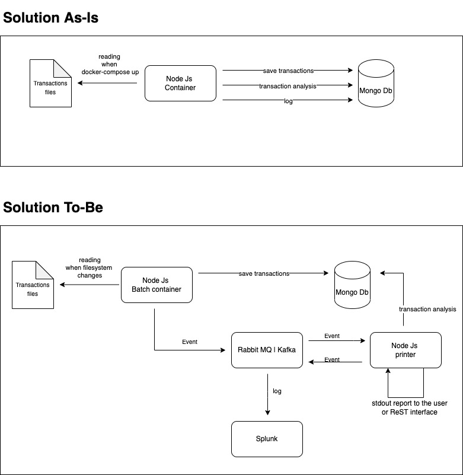

# Solution design

## Architecture


## How to run the project
From the console enter in the project folder, and execute:

```bash
docker-compose up --build node
```

```bash
docker-compose logs --tail 10 node | cut -f2 -d "|" 
```


## Assumptions
* Deposited balances are calculated: `receive transactions - send transactions`.
* Transactions of categories `immature` and `generate` are omitted.
* A registered customer has been associated with a single bitcoin address. 
* A deposit is valid when it has at least 6 confirmations and is associated with a known customer.
* Confirmations are not verified for deposits without reference.

## What could be improved
* In this model, a customer has a single BTC address. The application should handle multiple addresses for every account.
* Implement a circuit breaker to handle the connection with mongo db.
* Implement an event-driven design architecture.


