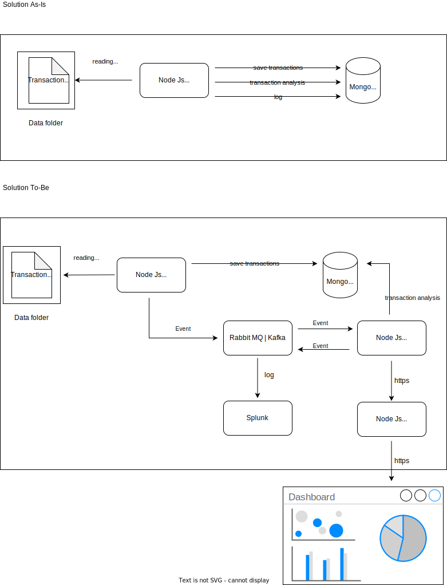

# Solution design

## Architecture


## How to run the project
From the console enter in the project folder, and execute:

```bash
docker-compose up --build node
```

```bash
docker-compose logs --tail 10 node | cut -f2 -d "|" 
```


## Assumptions
* Jsons are stored in `DATA` folder.
* The transaction ID is rapresented as `txid`#`vout` (ex. 0b525fa570718ba84def4cea1ab464a4dedf24ba7616e057a502a76f4a232258#23)
* Deposited balances are calculated: `receive transactions - send transactions`.
* Transactions of categories `immature` and `generate` are omitted.
* A registered customer has been associated with a single bitcoin address. 
* A deposit is valid when it has at least 6 confirmations.
* Files are not deleted after they have been readed.
* This project is TDD oriented. All tests are in the `batch-reader-tests.js` in the `test` folder.


## What could be discussed
* In this model, a customer has a single BTC address. The application should handle multiple addresses for every account.
* Implement a circuit breaker to handle the connection with MongoDB.
* Implement an event-driven design architecture.
* Secure MongoDB connection string.
* Implement a schema validation with Mongoose
* I have chosen to save all the transactions (without filters) on the database and perform the elaborations through the MongoDB pipelines. An alternative could have been to keep all the transactions in a raw collection and then separate the valid ones from the others.


